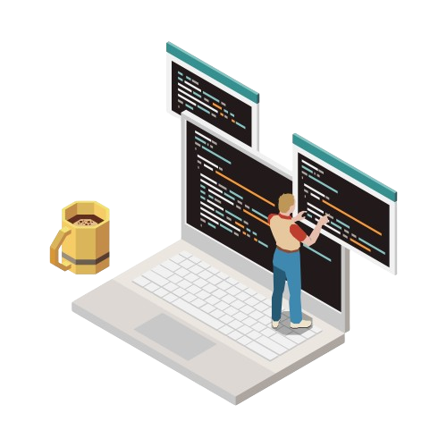

   
  
  

 

  Atualmente sou do Rio Grande Do Norte, tenho 19 anos de idade e sou Desenvolvedor Full stack.
  
  Sou Graduando em Sistemas para Internet no Instituto Federal de Ciência e Tecnologia do Rio Grande Do Norte (IFRN) no período 4/6, e atualmente estou empenhado em aprimorar minhas habilidades como desenvolvedor. Estou diariamente em busca de projetos em grupo com amigos, ou/e projetos pessoais que, alguns dos diversos são encontrados por aqui. 😁

 
  Estou sempre em busca de desafios e oportunidades para aprender e crescer na minha área, me tornando assim um profissional cada vez mais completo. 
   Se você estiver interessado em colaborar ou compartilhar ideias, entre em contato comigo. 

   
    Adoro explorar maneiras de tornar o mundo digital um lugar melhor, contribuindo para uma vida melhor.

<h2 align="center">
 🌟 Tecnologias:
</h2>

<h2 align="center">
 🚀 Tecnologias que estou aprendendo:
</h2>

  💌 Sinta-se a vontade para entrar em contato: ⤵️

 
 
<table>

  
    
  |  |  |  |
| :-: | :-: | :-: |

|  |  |
| :-: | :-: |
  </tr>
</table>
